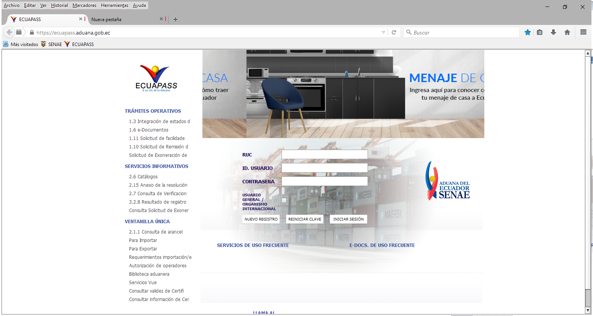

# Ecuapass en Ruffle: estado para continuar

Fecha: 24 de septiembre de 2026. Rama: `ecuapass-public-homepage-wip`. Base anterior en `master`: `09fb49dc7`.

## Objetivo y estado

La meta es que la portada pública de https://ecuapass.aduana.gob.ec/ se dibuje y responda como en SENAE Browser, en distintas resoluciones. No se incluyen el inicio de sesión ni los trámites.

**Estado: incompleto.** El SWF, las bibliotecas Flex, los recursos XML/ZIP y las respuestas AMF de prueba cargan; los campos RUC, ID. USUARIO y CONTRASEÑA aceptan texto ficticio. Los encabezados azules de la columna izquierda siguen invisibles en esta rama. El rótulo «USUARIO GENERAL / ORGANISMO INTERNACIONAL», el hover, la estabilidad de cinco cargas y el rendimiento aún requieren verificación. No usar esta rama como versión final.

Las capturas muestran ventanas de 1536 px de ancho. La referencia de SENAE incluye 130 px de interfaz del navegador por encima del contenido SWF; se debe descontar esa altura al comparar coordenadas.

## Lo que se comprobó

- Una captura nueva de la pestaña Red de SENAE Browser registró **51 solicitudes**, incluidas **17 POST AMF** con HTTP 200. La carga observada fue de unos **7,93 s**. El HAR local no se incluye porque puede contener cookies y datos de sesión.
- `Term.zip/Term.xml` aporta textos como `IPT_L_chk_main = USUARIO GENERAL / ORGANISMO INTERNACIONAL`. `Menu_spn.xml` aporta la jerarquía de opciones. `Code.zip`, `Property.xml`, `Property.zip` y `Msg.zip` aportan listas, configuración y mensajes. Las respuestas AMF observadas no contienen propiedades `width`, `height`, `fontSize` o `paddingLeft` de esta pantalla. Por tanto, las posiciones no se pueden deducir solo de la red.
- Se descompiló localmente el SWF público `/ipt_server/ipt_flex/ipt_flex.swf` con JPEXS. La clase `ec.gob.aduana.ecuapass.cmm.IptStart_vertical` fija un contenedor centrado de **992×740 px** y construye el formulario. Su `Label4` para el rótulo de organismo tiene **100 px** de ancho, **Tahoma 10 en negrita** y `paddingTop=8`; está en un `HGroup` con separación de 2 px, seguido por el checkbox. Los encabezados son `RichText` con `paddingLeft=10`. El estilo `mainTitleNuevoDisenio2019` de `ipt_flex` fija Tahoma 12, negrita y `letterSpacing=-4`.
- La clase `renderer.List_itemRenderer` usa `assets.skin.Btn_textOverLineSkin`; en estado `over` esta piel cambia el color a azul y establece `textDecoration=underline`. El hover debe reproducir ambas cosas.
- Ruffle se instrumentó en `flash.text.engine.TextBlock/TextLine` (AVM2, ActionScript 3). Para «TRÁMITES OPERATIVOS», Flex solicita `createTextLine` con ancho **1.000.000 px**. El fallback de `EditText` inicialmente lo envolvía como líneas de un carácter, dando **288 px** de alto. La rama evita ese ajuste antes de medir: ahora la línea mide aproximadamente **154×14,4 px**, pero sigue invisible. La última traza sitúa su rectángulo global en **x=321–475, y=142,6–157** en coordenadas del SWF, mientras la referencia de SENAE muestra el encabezado aproximadamente en **x=325, y=154–164** después de descontar la interfaz del navegador. El siguiente paso es corregir la relación entre línea base, posición y recorte del `TextLine`, sin desplazamientos específicos del portal.
- En el equipo actual la pantalla era **1536×864** y el área útil **1536×816**. El script local de Playwright hacía clic en x=1042, fijo para 1975 px; se corrigió fuera del repositorio a `viewportWidth / 2 + 55`. En 1536 px los campos aceptaron texto ficticio. La comparación todavía debe repetirse en 1280, 1536 y 1920 px y con distintas alturas.

## Código incluido en esta rama

Los cambios sin terminar abarcan deserialización AMF, APIs FTE de AVM2, métricas y renderizado de texto, contenedores de `TextLine`, eventos de entrada y el contenido de la extensión. El código de trazas temporal se retiró del árbol fuente antes del commit. La compilación de la extensión terminó correctamente; **la prueba visual no pasó**.

La regresión se debe probar en los tests SWF de AS3/AVM2 de Ruffle, especialmente `tests/tests/swfs/avm2/textline_splitting_basic`, y en Chrome contra Ecuapass. `CONTRIBUTING.md` describe cómo los tests SWF comparan `trace()` con la salida de Flash Player. **No restaurar ni ejecutar** `tests/tests/swfs/from_shumway/as3-loader/LoaderLoadBytesTest2/test.swf`: Trend AI lo puso en cuarentena y por eso aparece como eliminado solo en el equipo original; no forma parte de este commit.

## Cómo retomar

1. Clonar el fork y cambiar a `ecuapass-public-homepage-wip`. Instalar Rust con `wasm32-unknown-unknown` y `wasm-bindgen-cli 0.2.127`, como indica `web/README.md`. Instalar las dependencias Node de `web` y compilar la extensión según ese README. El paquete de extensión se genera en `web/packages/extension/dist/ruffle_extension.zip`.
2. Cargar la extensión descomprimida en Chrome para Windows. Comparar la misma URL, tamaño y escala con SENAE Browser, sin DevTools abiertos en la captura de referencia. Revisar **consola**, excepciones, AMF, estado del canvas y cambios de `iframe`; HTTP 200 por sí solo no acredita que Flex haya dibujado.
3. Resolver el encabezado FTE con una prueba focalizada de AS3. Después verificar el rótulo del checkbox, el cursor de escritura y la alineación del puntero. Para hover, comprobar color **y subrayado**. Usar un marcador visual de puntero que no intercepte eventos.
4. Repetir cinco cargas con caché caliente a varios tamaños; ninguna debe quedar en blanco. Medir el tiempo hasta el primer fotograma útil y compararlo con SENAE Browser. El objetivo acordado es una mediana menor o igual a **1,5×** la de SENAE. Probar las opciones públicas sin enviar el formulario ni iniciar trámites.

Los SWZ Flex se guardaron localmente durante las pruebas para evitar depender de la CDN, pero la caché, el HAR, las respuestas AMF y perfiles del navegador **no están en Git**. En otra PC hay que descargarlos de nuevo o capturar una sesión propia. El SWF se obtiene en `https://ecuapass.aduana.gob.ec/ipt_server/ipt_flex/ipt_flex.swf`; los nombres de clases anteriores permiten repetir la inspección con JPEXS.
